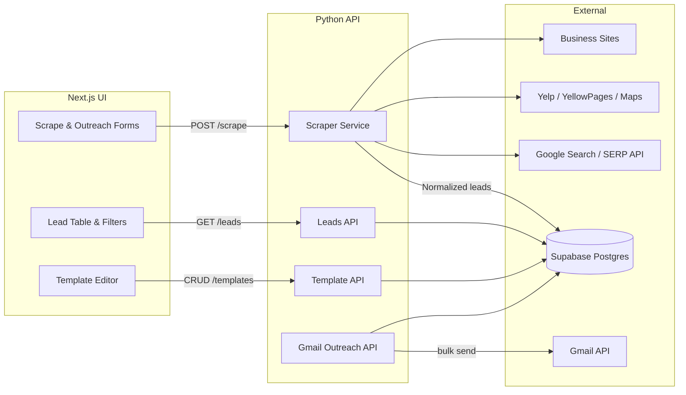

# System Architecture

## Workflow
1. **Scrape:** Frontend posts industry/city to the scraper endpoint. Scraper pulls SERP data, crawls listings, normalizes contacts, deduplicates, and writes to Supabase.
2. **Lead Management:** Frontend lists leads via `/leads` with filters for industry, city, and status. Exports use `/leads/export`.
3. **Templates:** CRUD endpoints store templates with merge variables for preview and sending.
4. **Outreach:** User selects leads + template, triggers `/outreach/send`. Service sends via Gmail API, records message IDs, timestamps, and statuses.

## Services
- **Scraper Service:** Fetches search results (SERP API or headless fallback), crawls candidate domains, extracts emails/phones/socials, dedupes by domain/phone.
- **Lead Service:** Persists leads, enforces unique constraints, supports soft delete and status updates.
- **Template Service:** Manages templates with merge variables and preview rendering.
- **Outreach Service:** Handles Gmail OAuth, rate limiting, bulk send, retries, and logging.

## Environment & Secrets
- `SERP_API_KEY` — optional but recommended for reliable search results.
- `SUPABASE_URL` / `SUPABASE_SERVICE_ROLE_KEY` — database access.
- `GOOGLE_CLIENT_ID` / `GOOGLE_CLIENT_SECRET` / `GOOGLE_REDIRECT_URI` — Gmail OAuth.
- `SCRAPER_USER_AGENT` — rotated user agents for crawling.
